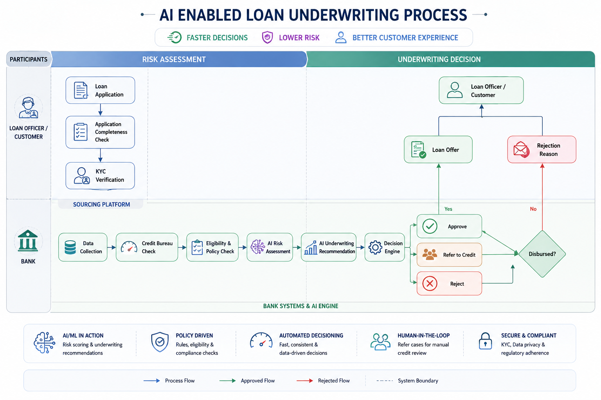
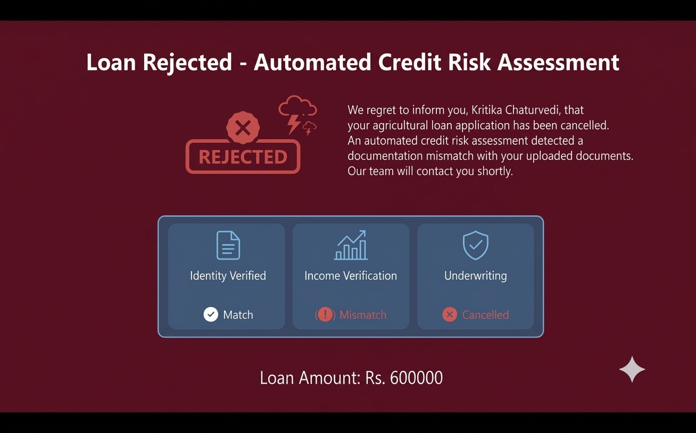

# Loan-underwriting

The Loan Underwriting System evaluates loan applications using predefined business rules and credit assessment criteria.

Kindly click on the thumbnails below to watch demo videos.

### Key Features

- 🤖 AI-assisted Underwriting
- 📄 Automated document extraction
- 🌾 Agricultural land, Income & Asset verification
- 💰 Loan eligibility assessment
- 👤 Credit-manager decision support

## 1️⃣ Loan Approved ✅

Demonstrates a successful loan application that satisfies all underwriting requirements.

<a href="https://www.youtube.com/watch?v=5YBf9jFUd-U">
  

### Scenario Highlights

- Information validated through documents
- Net Free Cash Flow to Annual Installment ratio >= 1.5:1
- Customer Segmentation: Strong Financial Profile, Existing customer - Low Exposure or New customer- Low Exposure
- Prediction of Default: Low
- Automated Decision: Approved

## 2️⃣ Loan Rejected ❌

Illustrates the rejection workflow when an applicant fails to meet underwriting criteria.

<a href="https://www.youtube.com/watch?v=5Gsl9VzjjTM">
  

### Scenario Highlights

- Low income or High debt burden
- Net Free Cash Flow to Annual Installment ratio < 1.1:1
- Customer Segmentation: Existing customer - High Exposure or New customer- High Exposure
- Prediction of Default: High (Risk threshold exceeded)
- Automated Decision: Rejected
  
## 3️⃣ Referred to Credit Manager 🔍

Shows cases requiring manual underwriting review by a credit analyst.

<a href="https://www.youtube.com/watch?v=nZG7hzejcBM">
  

### Scenario Highlights

- Borderline eligibility
- Net Free Cash Flow to Annual Installment ratio >= 1.1:1
- Additional document verification
- Manual risk assessment

## 4️⃣Information Mismatch ❌ 

When inconsistencies are detected between applicant-provided information and verification data, the application is flagged for review.

<a href="https://www.youtube.com/watch?v=nZG7hzejcBM">
  

### Scenario Highlights

- Identity verification discrepancies
- Land or Income validation issues
- Loan application cancelled
- Customer to re-login with correct details

