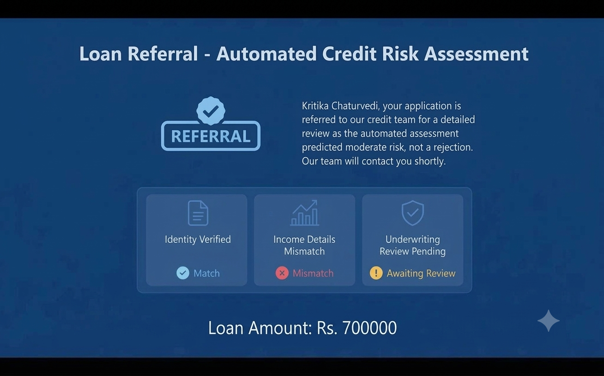

# Loan-underwriting
To create a term loan underwriting assistant for credit manager

The Loan Underwriting System evaluates loan applications using predefined business rules and credit assessment criteria. The following demonstrations showcase the major decision outcomes.

### Key Features

- 🤖 AI-assisted underwriting
- 📄 Automated document extraction
- 🌾 Agricultural land & asset verification
- 💰 Loan eligibility assessment
- 👤 Credit-manager decision support

## 1️⃣ Loan Approved ✅

Demonstrates a successful loan application that satisfies all underwriting requirements.

<a href="https://www.youtube.com/watch?v=5YBf9jFUd-U">
  

### Scenario Highlights

- Positive credit assessment
- Eligible debt-to-income ratio
- Sufficient income verification
- Automatic approval decision

2️⃣ Loan Rejected ❌

Illustrates the rejection workflow when an applicant fails to meet underwriting criteria.

<a href="https://www.youtube.com/watch?v=5Gsl9VzjjTM">
  

Scenario Highlights

Poor credit profile
High debt burden
Risk threshold exceeded
Automated rejection decision
3️⃣Referred to Credit Analyst 🔍

Shows cases requiring manual underwriting review by a credit analyst.

Scenario Highlights

Borderline eligibility
Additional document verification
Manual risk assessment
Analyst-assisted decision process

4️⃣Information Mismatch

When inconsistencies are detected between applicant-provided information and verification data, the application is flagged for review.

Scenario Highlights

Identity verification discrepancies
Income validation issues
Data inconsistency detection
Automated review recommendation

